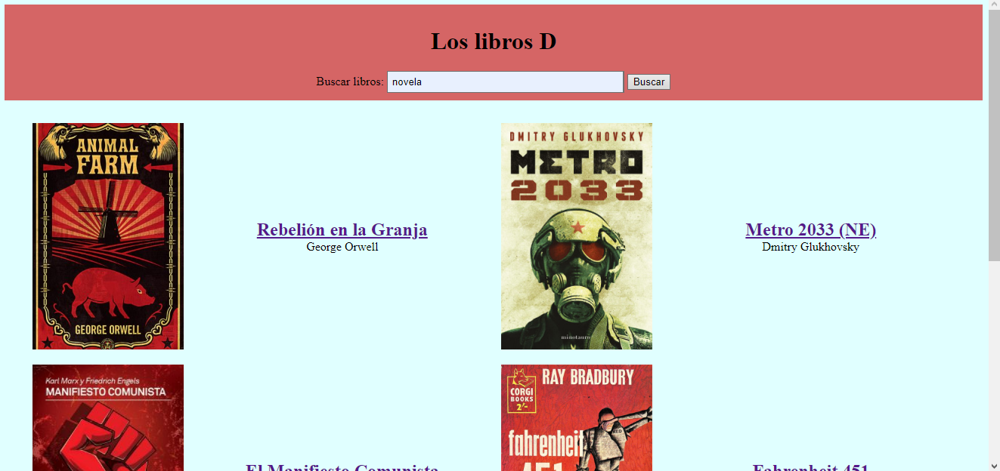
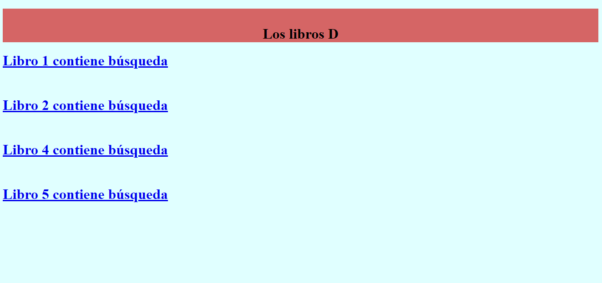
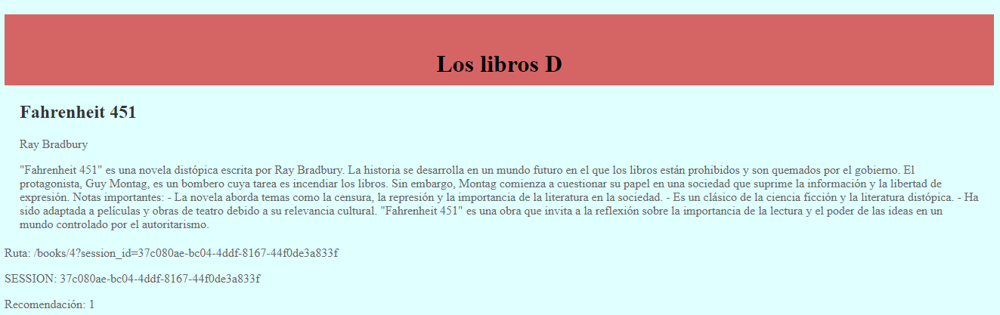
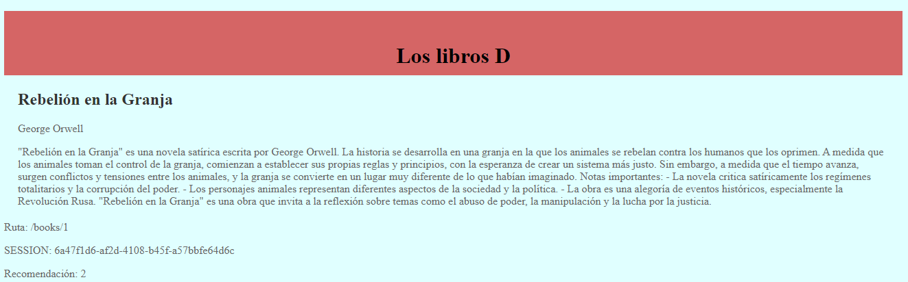

**INSTITUTO TECNOLÓGICO DE TIJUANA** 
**Subdirección académica** 
**Departamento de sistemas y computación** 
**Semestre Agosto - Diciembre 2023** 
**Ingeniería en sistemas computacionales**
##### Nombre del alumno:
**Vázquez Gutiérrez Johan Sebastian – 19211747** 
##### **Programacion Web**
Lunes 25 de septiembre del 2023

# Título del Proyecto
**Proyecto 01 - Sistema de Búsqueda y Recomendación de Libros**

## Descripción del Proyecto
Este proyecto es un sistema de búsqueda y recomendación de libros en línea utilizando AWS de amazon. Los usuarios pueden buscar libros por palabras clave y recibir recomendaciones personalizadas según su historial de navegación. El proyecto está construido en Python y utiliza Redis como base de datos para almacenar información sobre libros y sesiones de usuario.

## Funcionalidades Clave
- Búsqueda de libros por palabras clave.
- Visualización de detalles de un libro.
- Recomendación de libros basada en el historial de navegación del usuario.
- Sesiones de usuario gestionadas sin el uso de cookies.

## Video Demostrativo
<iframe width="1920" height="1000" src="https://www.youtube.com/watch?v=FOJgT9wPuXM" frameborder="0" allowfullscreen></iframe>

## Capturas de Pantalla

